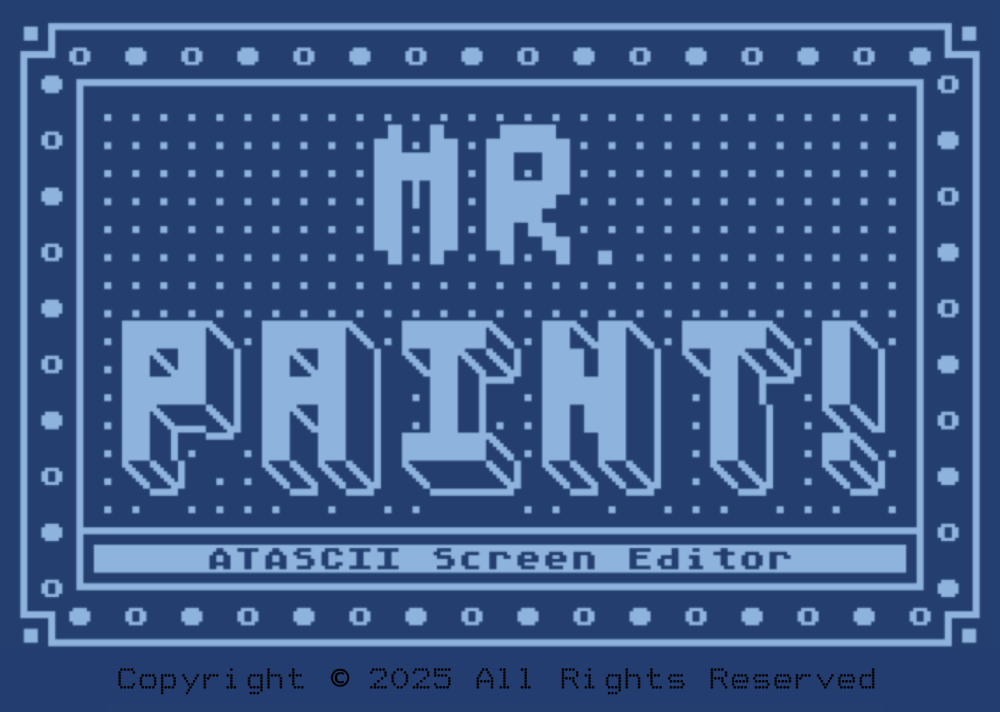

## Mr. Paint

Mr. Paint is a simple ATASCII text screen editor.  It is designed to allow the creation of single screens (40 columns by 24 rows).  It is not designed for the creation of ATASCII movies.  In other words, it does not record or save cursor movements or other active screen manipulation keystrokes.  It is suitable for creating text screens with ATASCII or ASCII content.

Mr. Paint was developed using the C language and compiled with CC65.  The user interface highly utilizes my A8CLibrary (Atari 8 Bit C Library) TUI (Text User Interface) routines.
#  
### Mr. Paint’s Core Features:

-ATASCII Save

ATASCII saves utilize carriage returns at the end of each line, with or without trimmed lines, and with or without a preceding clear character.

-Sized Save

Sized saves save the screen content up to the end of screen marker which can be set by the user, but otherwise follows the ATASCII save.

-Raw Save

Raw saves save the entire screen without a clear character, carriage returns (newlines), or trimmed lines.

-Disk Directory

The disk directory function provides a means to see the files on attached disks.  It has the ability to specify file masks to refine file searches.

-Print Screen

Print allows the screen editor contents to be output to a printer that supports ATASCII printing.

-Advanced User Interface

The user interface follows typical modern day interface standards making usage easy to understand.  Mr. Paint also goes to great lengths to prevent the accidental destruction of an edited screen through confirmation prompts where appropriate.  In addition, any time there a user entry field is presented, a small “Nav” bar will appear on the bottom of the window indicating which keys are active for that input control.

-Useful Functions

Many functions are included to help speed up the drawing process.  Such as: Wiping a line to the left or right, or the entire line; inspecting a character; centering a row; filling a column or row with a character; filling the background, etc.

-Simple Operation

Mr. Paint was designed without a lot of fluff, to do one thing, using modern interface elements, and minimal keystroke combinations to remember, making it easy to use.
  
Note: Block operations are still in development.  Source will be released when that is complete.
#  
### License

ATTRIBUTION-NONCOMMERCIAL-SHAREALIKE 4.0 INTERNATIONAL

See license.md for details.
